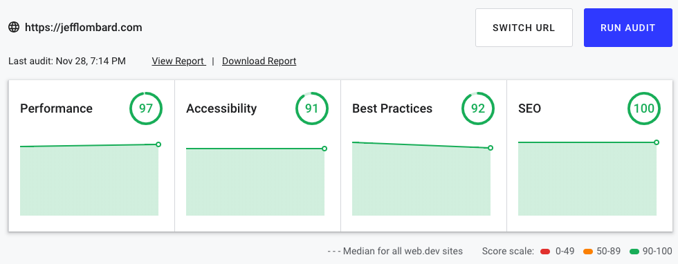

# jefflombard.com-v4
4th iteration of JeffLombard.com

The purpose of this site is to serve as an aggregator of all projects and learning I am doing in my spare time.

When wrapping up most of the site I ran [web.dev](https://web.dev/) which is google's site auditing tool. I was pleased when I achieved this rating. It's not all 100's but I think the [80/20 rule](https://en.wikipedia.org/wiki/Pareto_principle) applies here. Until, I need to scale to millions of users this is more than adequate ;)

## Interesting parts of this codebase.
I wanted to highlight some of my favorite parts of this codebase, so that people viewing this could appreciate the time that went into this site.

### GraphQL

**BackEnd**: I decided to use `GraphQL`, because I thought it was an easy way to aggregate data from multiple sources into one convenient endpoint. See [When and why to use GraphQL](https://medium.com/@JeffLombardJr/when-and-why-to-use-graphql-24f6bce4839d).

Most of the `GraphQL` stuff is in [/schema](schema/)

**FrontEnd**: I like [apollo](https://www.apollographql.com/) because of it's ease of setup.

### React

#### Refs
I had a [valid use case](https://reactjs.org/docs/refs-and-the-dom.html) for `refs` and used one to trigger the playing of the video in [src/src/App.js](src/src/App.js)

#### React Router

I'm using React Router, and created the [scenes/](scenes/) directory to house components that would show in the main window.

#### Some Really Dumb Components
([Yes that's a good thing](https://medium.com/@dan_abramov/smart-and-dumb-components-7ca2f9a7c7d0).)

I think [BrandedButton](src/src/components/BrandedButton.js) and [BrandedAnchor](src/src/components/BrandedAnchor.js) are some good examples.

### sketch

I did the FrontEnd designs before I touched any code. See [/sketch](sketch/)

### lodash

The list of filter able tags is autogenerated. I use some convenient `lodash` methods to flatten the list. See: [src/src/scenes/Projects.js](src/src/scenes/Projects.js)

### javascript/es6

`project.filter().map()` in [src/src/components/ProjectsList.js](src/src/components/ProjectsList.js).

### scss

I didn't need a full-fledged grid system because I was using `react-grid-system` so I made this cool little mixin: [media-up($breakpoint)](src/src/styles/grid.scss) and used it in components like [book](src/src/components/Book.scss).

## Addressing Potential Critiques

### Why are there no automated tests?

I strongly believe in writing tests for software. When appropriate. In most businesses, this is 100% of the time. That being said my personal website is not a business, and is not a service provider of any sorts. The primary goal of my site is to aggregate the various projects and activities I am working on. [Opinion: When to write tests](https://medium.com/@JeffLombardJr/opinion-when-should-i-write-unit-tests-164b245bffbc).

I'm not against testing at all, in fact, I think I will most likely add tests in the near future now that the site is at `MLP` state. (Minimal Lovable Product). It's in the "mature" stage of the product life cycle, the focus is now shifting from rapid development to stability, minor feature adds, and maintenance. So automated tests are more attractive to me.

Still not convinced? Alright yes, I agree with you some of the `express` and `graphql` stuff should have been TDD'd. But cut me some slack for admitting that?

*Still reading?* [See principle #1](http://wiki.c2.com/?LazinessImpatienceHubris)

### You're only using a portion of GraphQL

I know. I like simple, [this](https://news.ycombinator.com/hn.js) to me is beautiful code. As much as code can be beautiful. Just because tools have features doesn't mean you have to use them.

I'm using GraphQL as a composite, to [aggregate data from multiple sources](https://medium.com/@JeffLombardJr/when-and-why-to-use-graphql-24f6bce4839d). I have no desire to write to a db. In fact, if I didn't have multiple sources, I probably would have even ditched `mongodb` and just used a `json` file.

### Why no static site generation with Gatsby?

I thought about it. Gatsby/Netlify is a joy. But I wanted to show some `node` chops with `heroku` and `express`.
